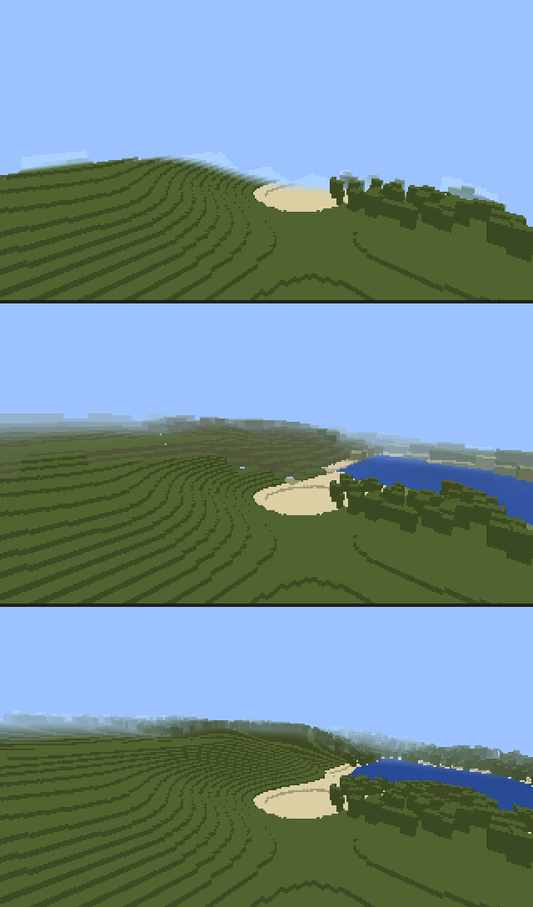

# Distant Lands

Distant terrain for **Minecraft Bedrock 26.3+**, inspired by the Java mod
[Distant Horizons](https://gitlab.com/distant-horizons-team/distant-horizons).
Beyond your normal render distance, Distant Lands draws a lightweight level-of-detail (LOD) copy of the world,
out to a configurable **8–32 chunks**. Real chunks load exactly as they always do. The LOD copy fills the
horizon around them and hands over to real terrain as you approach.



<sub>Top: vanilla with a 6-chunk render distance. Middle: the same view with Distant Lands (LOD to 16 chunks).
Bottom: every chunk loaded at full detail, for reference. These are <b>simulated renders</b> made by the
project's test rasteriser from a fake Bedrock runtime (`npm run preview`), not in-game screenshots.</sub>

- **No forced chunk loading for rendering.** The LOD is built from compact height and colour samples, not loaded chunks.
- **Uses your world's own generator.** Terrain comes from chunks you explore, plus optional short-lived ticking areas
  that let the normal world generator produce unexplored terrain. Seed, biomes and generation rules are untouched.
- **Survival friendly.** No cheats or experiments are needed, and nothing changes gameplay. Works in single player,
  multiplayer and on dedicated servers, with a separate view for each player.
- **Nearest terrain first.** Work is prioritised by distance and view direction, and time-sliced to a per-tick script budget.
- **Configurable:** distance, quality, update frequency, generation priority, performance limits, cache,
  terrain styles, fog, lighting and per-player overrides, all from an in-game menu.

## Install

1. Download [`dist/DistantLands-v1.0.0.mcaddon`](dist/DistantLands-v1.0.0.mcaddon). CI also publishes a fresh build
   as a workflow artifact on every pull request.
2. Open the file. Minecraft imports the behavior pack and the resource pack.
3. In **Edit World → Behavior Packs**, activate **Distant Lands**. The resource pack is activated with it.
   No experimental toggles are required.
4. Optional: in **Resource Packs → Distant Lands → ⚙**, pick a visual variant (see [Subpacks](#subpacks)).

**Dedicated server:** copy `DistantLands_BP` to `behavior_packs/` and `DistantLands_RP` to `resource_packs/`.
Then add both packs to the world's `world_behavior_packs.json` and `world_resource_packs.json`.

Keep your video render distance where you like it: Distant Lands draws beyond it.

## Using it

Join the world and look at the horizon. Areas you have explored appear within seconds. Unexplored terrain
is generated in the background, nearest first (see `genMode`).

- **Settings menu:** run `/dl:horizon`, or use a **Horizon Lens**. The lens is crafted shapeless from a compass and a
  glass pane, and unlocks when you get a compass. Everyone can change their own view. World settings are for
  operators.
- **Statistics on screen:** `/dl:horizon hud` toggles an action-bar readout of faces, tiles, cache, generation queue,
  script time and the detected render distance.

### Commands

`/dl:horizon [action] [value]` works without cheats. Each action is also available as
`/scriptevent dl:<action> [value]` for command blocks and functions.

| Action | Who | What it does |
| --- | --- | --- |
| `menu` (default) | everyone | Opens the settings menu. |
| `stats` | everyone | Prints LOD statistics for you. |
| `toggle` | everyone | Turns distant terrain on or off just for you. |
| `hud` | everyone | Toggles the statistics action bar. |
| `selftest` | everyone | Spawns a coloured 4×4 test pattern about 32 blocks ahead and reports what your device supports. |
| `pregen [radius]` | operator | Generates LOD data around you for the next 10 minutes (radius in chunks, default: max distance). |
| `preset <0-4>` | operator | Applies a preset: 0 potato, 1 low, 2 medium, 3 high, 4 ultra. |
| `clear` | operator | Deletes all cached LOD data. Existing faces fade out on their own. |
| `reset` | operator | Restores every world setting to its default. |
| `set` | operator | `/scriptevent dl:set <setting>=<value>`, e.g. `/scriptevent dl:set maxDistance=32`. |

## Settings

World settings are saved in the world. Player settings are saved on each player and can only lower the world
limits. The keys below work with `dl:set`.

**General**

| Setting | Key | Values | Default |
| --- | --- | --- | --- |
| LOD rendering | `enabled` | on / off | on |
| Max LOD distance | `maxDistance` | 8–32 chunks | 24 |
| LOD quality | `quality` | 0 Low, 1 Medium, 2 High, 3 Ultra, 4 Custom | Medium |
| Custom quality factor | `qualityFactor` | 6–28 (12 ≈ Medium, 16 ≈ High, 22 ≈ Ultra) | 12 |
| Sample resolution | `sampleRes` | 0 = 2 blocks, 1 = 4 blocks, 2 = 8 blocks | 4 blocks |
| Render The End | `renderEnd` | on / off | off |

**Generation**

| Setting | Key | Values | Default |
| --- | --- | --- | --- |
| Data source | `genMode` | 0 Off (cached data only), 1 Explored terrain only, 2 Generate distant terrain | Generate |
| Generation priority | `genPriority` | 0 Nearest first, 1 Where you look, 2 Balanced | Balanced |
| Generation batch | `genBatch` | 2–8 chunks per side | 4 |
| Concurrent batches | `genConcurrency` | 1–3 (one ticking area each) | 1 |
| Pause while flying | `genPauseFlying` | on / off | on |

**Updates and performance**

| Setting | Key | Values | Default |
| --- | --- | --- | --- |
| Refresh interval | `refreshSeconds` | 8–60 s | 15 |
| Resample interval | `resampleMinutes` | 1–60 min | 10 |
| Track block changes | `trackBlockChanges` | on / off | on |
| Script budget | `budgetMs` | 1–10 ms per tick | 3 |
| Particle spawns per tick | `spawnsPerTick` | 10–250 (shared by all players) | 60 |
| Max LOD faces per player | `maxQuads` | 1000–16000 | 4000 |
| Adaptive quality | `adaptive` | on / off | on |
| Pause underground | `pauseUnderground` | on / off | on |

**Cache**

| Setting | Key | Values | Default |
| --- | --- | --- | --- |
| Memory cache | `memoryChunks` | 1024–32768 chunks | 8192 |
| Save LOD data in the world | `persist` | on / off | on |
| Storage budget | `storageMB` | 1–32 MB | 8 |

**Display**

| Setting | Key | Values | Default |
| --- | --- | --- | --- |
| Terrain style | `style` | 0 Natural, 1 Vivid, 2 Cartographic (contours), 3 Elevation map, 4 Debug: LOD levels | Natural |
| Relief shading | `relief` | 0–100 % | 60 |
| Aerial perspective | `aerial` | 0–100 % | 35 |
| Water depth shading | `waterDepth` | on / off | on |
| Vegetation | `vegetation` | 0 Tree canopy, 1 Ground | canopy |
| Transition animation | `transitions` | on / off | on |
| Day/night lighting | `dayNight` | on / off | on |
| Fog | `fogMode` | 0 Horizon, 1 Vanilla, 2 Atmospheric haze | Horizon |

**Per player** (menu → *My view*): show distant terrain for me, my LOD distance, my quality, my max faces,
and show statistics.

### Presets

| Preset | Distance | Quality | Samples | Max faces | Spawns/tick | Budget | Memory |
| --- | --- | --- | --- | --- | --- | --- | --- |
| Potato | 12 | Low | 8 blocks | 1500 | 30 | 2 ms | 2048 |
| Low | 16 | Low | 4 blocks | 2500 | 40 | 2 ms | 4096 |
| Medium (default) | 24 | Medium | 4 blocks | 4000 | 60 | 3 ms | 8192 |
| High | 28 | High | 4 blocks | 7000 | 100 | 4 ms | 12288 |
| Ultra | 32 | Ultra | 2 blocks | 12000 | 160 | 6 ms | 16384 |

### Subpacks

| Subpack | Use it when |
| --- | --- |
| Standard | Default: textured, emitter-aligned faces. |
| Smooth | Flat colours, the cheapest look. |
| Compatibility | Top faces are direction-aligned. Use this if distant terrain looks rotated or missing on your device. |

## How it works

Bedrock add-ons cannot raise the client render distance or create meshes. Distant Lands therefore draws terrain
with **particles**, which the client does not cull by distance. Each LOD face (a cell's top, or a wall that fills a
height step) is one particle, sent only to the player who needs it with `Player.spawnParticle`. Size, colour,
offset, lifetime and lighting travel as Molang variables.

1. **Sampling.** Height, colour, water depth and vegetation are sampled every 2, 4 or 8 blocks. Chunks are sampled
   when they are loaded anyway, and re-sampled after block changes or when stale. With *Generate distant terrain*,
   small batches of unexplored chunks are loaded briefly through `tickingarea`, so the real generator produces them.
   The batches carry a one-chunk margin so decoration finishes, and the areas are removed right after sampling.
   Colours come from a palette of vanilla texture averages, combined with each block's biome tint.
2. **Storage.** Each chunk keeps its samples and coarser mip levels in typed arrays: water wins when at least half the
   cells are water, ridges are kept, and single trees are ignored. Regions of 8×8 chunks are compressed into world
   dynamic properties, so the horizon reappears instantly next session. An LRU cache and a storage budget bound
   memory and world size.
3. **Level of detail.** Each player's surroundings are split into a quadtree of tiles. Cells grow with distance
   (quality setting), and hysteresis avoids flicker. Tiles inside the real render distance are skipped. A
   conservative two-chunk band just outside it keeps LOD faces at or below the real surface.
4. **Meshing.** Each tile becomes packed tops and walls. Equal neighbouring tops merge into larger squares, and walls
   reach one block below the lowest neighbour, so there are no see-through gaps behind terrain steps. Relief shading,
   styles and water depth are applied here. Meshes are cached and shared by players.
5. **Rendering.** Faces are spawned nearest-first under a per-tick spawn budget. They live for a finite time and
   are refreshed on a rolling schedule, so stale terrain disappears by itself. Every face self-culls the moment the
   client has the real block at its position (`particle_expire_if_in_blocks`), which hands each spot over to
   vanilla terrain. Fast movement shortens lifetimes ahead of you. A per-player fog is pushed to the LOD distance.
6. **Scheduling.** All work is split into small steps and runs in a cooperative scheduler within the script budget
   (`system.runJob`). Plans are built incrementally while the old plan keeps rendering.

## Limitations

- **Not real geometry.** Distant terrain has no collision and no block lighting. Each cell has one colour, and
  structures show up as coloured height cells rather than blocks.
- **Generation saves chunks.** *Generate distant terrain* stores the generated chunks in the world, exactly like
  exploring them. Use *Explored terrain only* to avoid world growth. Generation uses 1–3 of the world's 10 ticking
  areas.
- **Fog.** *Horizon* fog replaces the air fog for each player. Another add-on that pushes fog may conflict; pick
  *Vanilla* fog in that case, though distant terrain may then be hidden by the default fog.
- **Dimensions.** The Overworld is supported, and The End is optional. The Nether is excluded because its ceiling
  leaves no meaningful surface to draw.
- **Particle budgets.** Low-end devices may cap particles. Use a lower preset, the *Smooth* subpack, or
  *My max LOD faces*.
- **Rendering paths.** Vibrant Visuals may light and fog particles differently from the classic renderer.

### Testing status

Minecraft cannot run in this project's CI, so the add-on was verified without the game:

- **Unit tests** cover every core module.
- **End-to-end simulations** run the production bundle against a fake Bedrock runtime: walking, sprinting,
  teleports, dimension changes, multiplayer, settings changes and world reloads.
- **Software-rendered comparisons** check the LOD against ground truth for holes and floating faces.
- **Performance runs** execute the core in QuickJS, the interpreter Bedrock uses for scripts.
- **Type-checking** uses the official 2.5.0 / 2.0.0 API typings.

It has **not yet been played in-game**, so please report how it behaves on your device. `/dl:horizon selftest` is
the quickest check.

## Development

Requires Node.js 22 or newer.

```sh
npm ci
npm run check      # type-check, all tests, validate the packed add-on
npm run pack       # build dist/DistantLands-v<version>.mcaddon (deterministic)
```

| Script | Purpose |
| --- | --- |
| `build` | Bundle `src/main.ts` into the behavior pack and copy both packs to `build/`. |
| `pack` | `build`, then zip both packs into `dist/*.mcaddon`. |
| `test` / `test:verbose` | Unit, simulation, render and QuickJS tests (`node:test`). |
| `typecheck` | TypeScript against the official `@minecraft/*` typings. |
| `validate` | Packs a fresh `.mcaddon` and checks manifests, versions, imports, JSON, textures and lang keys. It also checks that the committed `dist/` file is up to date. |
| `preview` | Re-renders the simulated comparison images in `docs/images/`. |
| `assets` / `palette` | Regenerate particles, fogs, lang and images / the block colour palette (Python 3). |

Layout:
- `src/core/` holds engine-independent logic: settings, palette, LOD data, store, sampler, planner, mesher,
  renderer, acquisition, scheduler and app.
- `src/bedrock/` holds the Script API adapters, forms and commands.
- `packs/` holds the pack sources.
- `test/` holds the tests and fakes.
- The design is in [`docs/superpowers/specs`](docs/superpowers/specs/2026-10-07-distant-lands-design.md).

Distant Lands is an independent project. It is not affiliated with Mojang, Microsoft or the Distant Horizons project.
